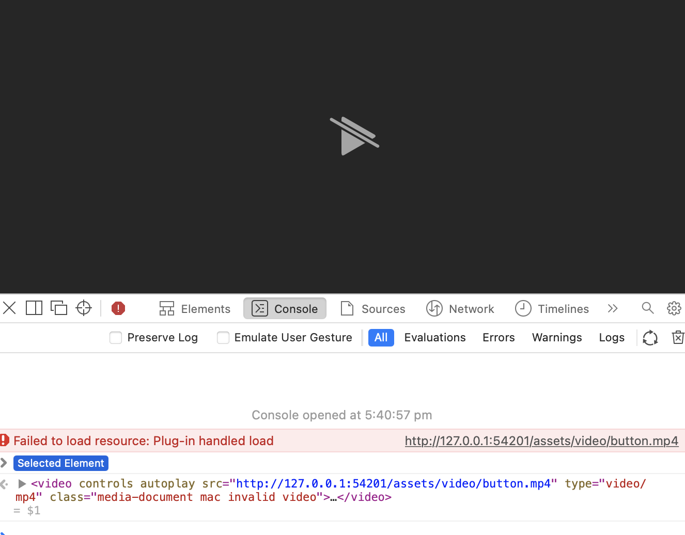
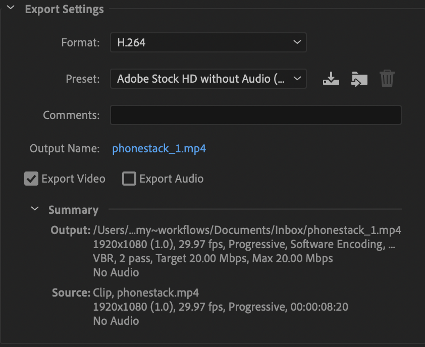

# Streaming video errors in Safari
I’m having an issue in Safari getting a .mp4 video to play, when hosted by a Digital Ocean app. In fact, it happens on my local server too. Here’s the sort of error I’m getting when I try to access the file directly:

## Answer
In my case it was just the format. I tried .mov files, and they worked perfectly in Safari (but, of course, don’t work in Chrome).

I re-encoded into .mp4, using Adobe Media Encoder with `Adobe Stock HD without Audio` settings, and it worked fine. So it was just an encoding error, nothing to do with servers at all.

## Troubleshooting
Full reasoning & thought process with other potential options for the same issue below.

I found this [Stack Overflow](https://stackoverflow.com/questions/18103103/failed-to-load-resource-plugin-handled-load-on-ios), where one poster says it’s because this is a blob server that is incapable of streaming responses, while Safari requires streaming responses.

Okay some official clarification from [Apple’s documentation](https://developer.apple.com/library/archive/documentation/AppleApplications/Reference/SafariWebContent/CreatingVideoforSafarioniPhone/CreatingVideoforSafarioniPhone.html#//apple_ref/doc/uid/TP40006514-SW6):

> Make sure the HTTP servers hosting your media files support byte-range requests, as described in [Configuring Your Server](https://developer.apple.com/library/archive/documentation/AppleApplications/Reference/SafariWebContent/CreatingVideoforSafarioniPhone/CreatingVideoforSafarioniPhone.html#//apple_ref/doc/uid/TP40006514-SW6).  

So looks like the options are:

- Change the server (set up a custom Node server potentially that serves the files, or use object storage for them)
	- I’ve opted for this – using Digital Ocean spaces for the video file storage (regrettably).
- Or potentially, [this answer](https://stackoverflow.com/questions/10511006/html5-video-not-working-on-ipad) may work – but requires the ability to change the headers.

wtf apple.

- **Update:** I tried with Digital Ocean spaces, and it didn’t work – exactly the same error as before. So now attempting a Google Cloud storage bucket.
- New approach: attempting an App Engine website, then if that doesn’t work I’ll try Cloud Storage.
	- AppEngine displayed the same problem.
- Google Cloud Storage
	- Cloud storage doesn’t work either… I am actually out of ideas. I can’t play a video in html. What.
- I’m starting to suspect this might be some sort of format issue, an dnot related to the answers above at all. Going to attempt this locally with a random .mov and see if it works.
	- All of a sudden it completely works.